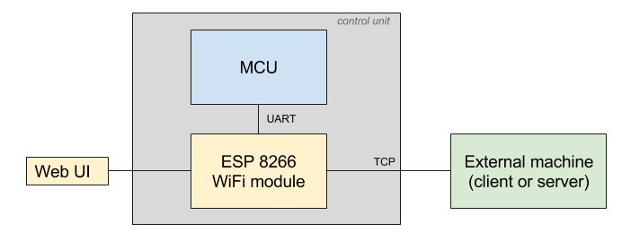
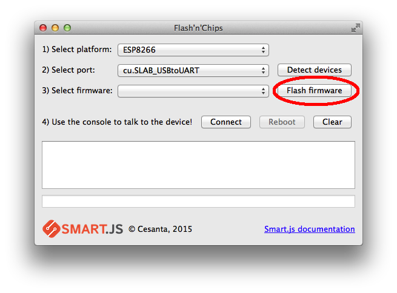
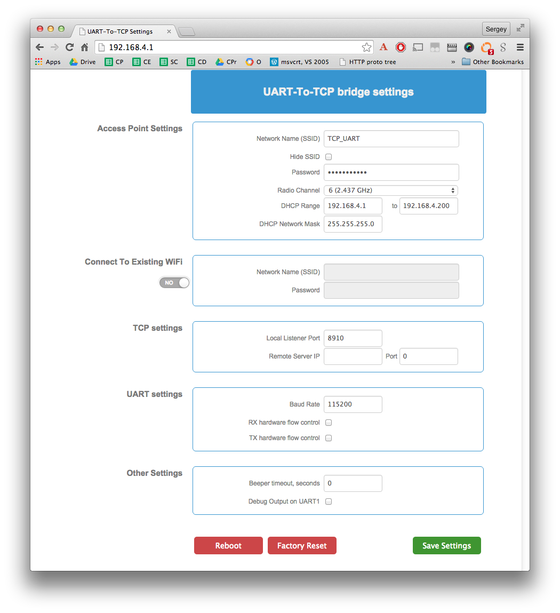
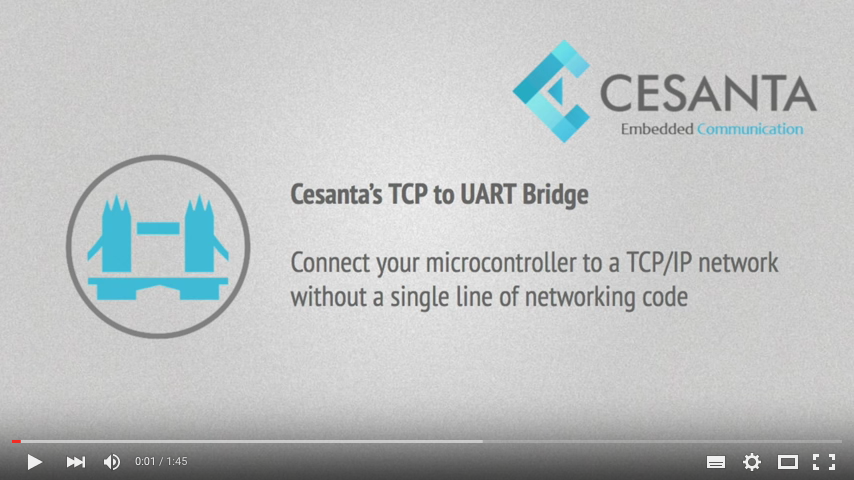

= TCP to UART bridge
(c) 2015 http://cesanta.com
:title-logo-image: 

Cesanta's TCP to UART bridge is a solution for connecting microcontroller
units (MCUs) to the Internet without embedded software development.

It works by connecting a WiFi module to the MCU via UART. When powered on,
the WiFi module creates a WiFi access point and runs a web server
which shows a settings page. That settings page drives the way the WiFi module
transfers data between the MCU and an external machine.

If you know how FTDI chips work by bridging USB to serial UART, you know how
our TCP to UART bridge works - the same idea, but rather than USB, it connects
TCP to the serial UART.
This is the easiest way to connect any MCU to a TCP/IP network:

The WiFi module acts as a transparent bridge between the MCU and the external host.
The external host can initiate the connection (act as a client), or the WiFi module
can initiate the connection (external host acts as a server). In either case,
when the TCP connection is established, all data that is read from the UART, gets
transmitted to the external host. All data that the external host sends to the
WiFi module, gets written to the UART.

<<<
== Quick Start Guide

- Download Flashnchips flashing tool from
   https://www.cesanta.com/download-tcp-to-uart-bridge
- Connect ESP8266 module to your computer via serial interface
- Unpack the firmware archive and flash the WiFi module using Flashnchips tool:

- Physically connect the ESP8266 module to the MCU - via ESP8266's UART0.
- Power on. The ESP8266 module will bring up a WiFi network with SSID
   "TCP_UART", password "Cesanta2015". Connect to that network.
- Point your browser at http://192.168.4.1  - you'll see a web interface:

- Specify "Local Listener Port" to a value, for example `8910`.
- Click "Save Settings".
- The ESP8266 module will reboot, and start listening on port `8910`.
- Now, any program that connects to `192.168.4.1:8910` will exchange data
    with the UART0

<<<

Check out our 2-minute video demonstration on Youtube:

link:https://youtu.be/VJ-6EiJV1GQ[]

## Technical Specification

- Reliable data transfer with no connection drops or transmission delays
- Up to 3 Mbps data rate transfer - bound by the UART speed
- Less than 15ms latency
- Optional RX/TX hardware flow control

## Contact Us

Cesanta is always open to hearing your feedback! Please contact us
at support@cesanta.com.
